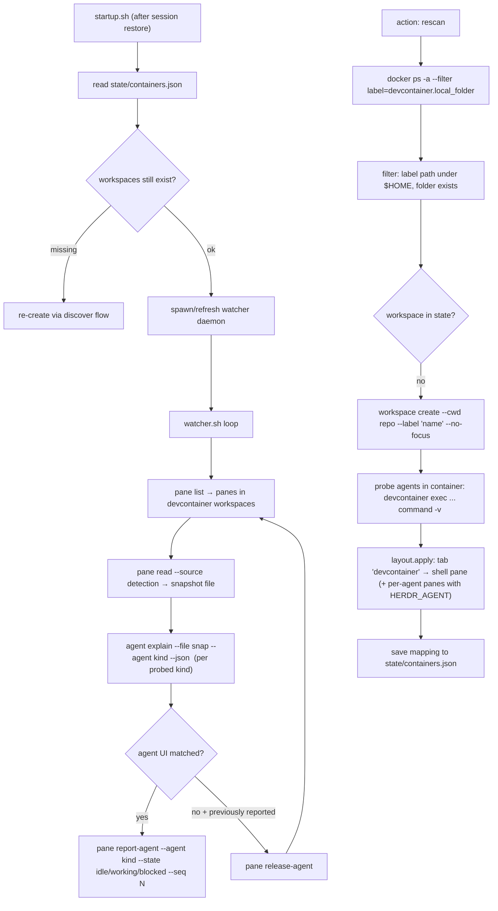

# 04 — Plugin design: `herdr-devcontainer-spaces`

Draft design for a plugin id `local.devcontainer-spaces`. Sketches live in
[`draft/`](../draft/) — **nothing installed**.

## Components

```
herdr-plugin.toml
scripts/
  lib.sh            # shared helpers + ENGINE ABSTRACTION (docker|podman, rootless detection,
                    #   devcontainer-CLI backend: DOCKER_HOST / podman socket / scoped shim)
  startup.sh        # [[startup]]  : engine detect, re-validate state, ensure watcher, rescan
  discover.sh       # [[action]] rescan : engine label scan → create/repair spaces
  open-shell.sh     # [[action]] shell-here : open in-container shell pane in current ws
  start-agent.sh    # [[action]] agent-here : run a chosen agent in current ws + notify watcher
  on-workspace-closed.sh  # [[event]] workspace.closed : drop state, tombstone
  watcher.sh        # background daemon (spawned detached by startup.sh) — engine-independent
  watcher-match.sh  # one-shot classifier: pane detection snapshot → agent+state
config.toml.example # engine pin, per-agent pane templates, auto-create on/off, poll interval
```

## Engine abstraction (docker | podman, rootless | rootful)

All engine access goes through `lib.sh`; no script calls `docker` or `podman` directly.

```bash
# lib.sh sketch
engine_detect() {
  # honor config pin: [engine] name = "docker" | "podman" | "auto"
  for cli in $(engine_candidates); do            # auto: docker, podman (order per config)
    command -v "$cli" >/dev/null || continue
    if "$cli" version >/dev/null 2>&1; then
      ENGINE="$cli"
      ENGINE_ROOTLESS=$("$cli" info -f '{{.Host.Security.Rootless}}' 2>/dev/null)
      case "$cli:$ENGINE_ROOTLESS" in
        podman:true)  ROOTLESS=1 ;;               # podman: .Host.Security.Rootless
        docker:*)     ROOTLESS=$("$cli" context show 2>/dev/null | grep -qx rootless && echo 1 || echo 0)
                      [ "${DOCKER_HOST:-}" = "${DOCKER_HOST#*"/run/user/"}" ] || ROOTLESS=1 ;;
      esac
      return 0
    fi
  done
  return 1  # caller emits actionable error
}

# Enumerate devcontainers identically on both engines: IDs via label filter,
# details via inspect+jq (avoids docker-vs-podman `ps --format json` shape drift).
dc_list() {  # lines: <id>\t<state>\t<local_folder>\t<config_file>
  local ids; ids=$("$ENGINE" ps -a --filter label=devcontainer.local_folder --format '{{.ID}}' || true)
  local id
  for id in $ids; do
    printf '%s\t%s\t%s\t%s\n' "$id" \
      "$("$ENGINE" inspect -f '{{.State.Status}}' "$id")" \
      "$("$ENGINE" inspect -f '{{index .Config.Labels "devcontainer.local_folder"}}' "$id")" \
      "$("$ENGINE" inspect -f '{{index .Config.Labels "devcontainer.config_file"}}' "$id")"
  done
}

# Make the devcontainer CLI work on podman-only machines (never touches user PATH).
dc_env() {  # prints env assignments; caller: eval or env-prefix invocation
  if [ "$ENGINE" = docker ] || command -v docker >/dev/null 2>&1; then return 0; fi
  if [ -n "${DOCKER_HOST:-}" ]; then return 0; fi                       # user already wired it
  if [ -S "${XDG_RUNTIME_DIR:-/run/user/$(id -u)}/podman/podman.sock" ]; then
    echo "DOCKER_HOST=unix://${XDG_RUNTIME_DIR:-/run/user/$(id -u)}/podman/podman.sock"
    return 0
  fi
  mkdir -p "$HERDR_PLUGIN_STATE_DIR/shim"
  printf '#!/bin/sh\nexec podman "$@"\n' > "$HERDR_PLUGIN_STATE_DIR/shim/docker"
  chmod +x "$HERDR_PLUGIN_STATE_DIR/shim/docker"
  echo "PATH=$HERDR_PLUGIN_STATE_DIR/shim:\$PATH"
}

dc()      { dc_env >/tmp/dc.env.$$ 2>/dev/null; [ -s /tmp/dc.env.$$ ] && eval "export $(cat /tmp/dc.env.$$)"; rm -f /tmp/dc.env.$$; devcontainer "$@"; }
dc_exec() { dc exec --workspace-folder "$1" "${@:2}"; }
dc_up()   { dc up   --workspace-folder "$1"; }
```

Rules encoded here:

- **User filter by mode**: `ROOTLESS=1` → engine is already user-scoped, keep the
  `$HOME` check only as a sanity log; `ROOTLESS=0` (shared daemon) → `$HOME` heuristic
  is authoritative, skip + log anything else.
- **Rootless env hygiene**: if `XDG_RUNTIME_DIR` is unset in the hook environment
  (Herdr server env), derive `/run/user/$(id -u)` before computing socket paths.
- **Shim isolation**: the `docker`→`podman` shim lives in plugin state and is prepended
  to PATH only inside `dc()` invocations. Containers are still enumerated via
  `$ENGINE` directly (podman CLI needs no socket), so discovery works even with no
  service socket at all.
- **`devcontainer up` caveat stays**: builds under buildah (SELinux, userns) remain
  deferred; `up` only ever starts existing containers.

## Data flow



## Key flows

### 1. Discovery & space creation (`discover.sh`)

1. `dc_list` (lib.sh): `ENGINE ps -a --filter label=devcontainer.local_folder --format '{{.ID}}'`,
   then per-ID `inspect` for `.State.Status` and the two labels. Works on docker and
   podman, rootless and rootful, unchanged.
2. Keep entries where `local_folder` starts with `$HOME` and the folder exists on disk.
   Rootless engine → filter is a sanity check (engine already user-scoped); rootful →
   this filter is authoritative. Log which one is active and every skipped container.
3. Skip folders already in `state/containers.json` with a live `workspace get`.
4. For each new folder:
   - `HERDR_BIN_PATH workspace create --cwd <folder> --label "<basename>" --no-focus`
     (space name is the directory name only — no path, no suffix)
     → capture `workspace_id`, root `tab_id`.
   - `devcontainer up --workspace-folder <folder>` **only if container State != running**
     and auto-start is enabled in plugin config; otherwise defer (first builds are slow).
   - Probe available agent binaries once:
     `devcontainer exec --workspace-folder <folder> sh -lc 'command -v claude codex ...'`
   - Build the tab tree with `layout.apply` (socket, via `HERDR_BIN_PATH api` or raw socket):
     ```json
     root: { type:"split", direction:"right", ratio:0.65,
       first:  { type:"pane", label:"shell",
                 command:["devcontainer","exec","--workspace-folder",FOLDER,"bash"] },
       second: { type:"pane", label:"claude",
                 command:["devcontainer","exec","--workspace-folder",FOLDER,"claude"],
                 env:{ "HERDR_AGENT":"claude" } } }
     ```
     One agent pane per *probed* agent kind, taken from plugin config templates.
   - Persist mapping + probe results in `state/containers.json`.
5. Idempotency: re-runs only repair missing workspaces; user-closed workspaces are
   tombstoned (see below) and not auto-recreated.

Fallback if `layout.apply` is unavailable on the installed Herdr: create panes via
manifest `[[panes]]` entrypoints (`shell`, `agent-claude`, …) with
`plugin pane open --plugin local.devcontainer-spaces --entrypoint shell
--workspace <id> --placement split --env DEVCONTAINER_FOLDER=<folder>` and have the
entrypoint script read `DEVCONTAINER_FOLDER`.

### 2. Watcher (`watcher.sh`) — agents started from in-container shells

Started detached by `startup.sh` (`setsid ... &`, lockfile in `HERDR_PLUGIN_STATE_DIR`,
inherits `HERDR_SOCKET_PATH`/`HERDR_BIN_PATH`):

Loop every N seconds (default 3):
1. `pane list` → panes whose `workspace_id` ∈ devcontainer set **and** pane not created
   as a dedicated agent pane (those have the `HERDR_AGENT` hint; Herdr owns them).
2. For each candidate: `pane read <id> --source detection > $TMP/snap`.
3. For each probed agent kind: `herdr agent explain --file $TMP/snap --agent <kind> --json`
   → take the result whose matched-rule evidence is strongest (e.g. non-fallback match).
4. Diff against last reported state per pane (`state/panes.json`):
   - new/changed → `pane report-agent <id> --source custom:devcontainer --agent <kind>
     --state <idle|working|blocked> --seq N`
   - no agent matched but previously reported → `pane release-agent <id>
     --source custom:devcontainer --agent <kind>`
5. Also cover exit races by subscribing to `pane.exited`/`pane.agent_status_changed`
   if event-driven wakeup is desired later (v1: polling only).

Notes:
- `report-agent` makes the plugin the pane's lifecycle authority → sidebar states,
  `agent wait`, `agent prompt` all work against in-container agents.
- Optional: pass `-- RESUME_COMMAND` via `report_agent`'s `resume_argv`
  (e.g. `devcontainer exec --workspace-folder X claude --resume <id>`) once session-id
  scraping is added.
- All reported state changes also `pane rename` (optional) for readable labels.

### 3. Lifecycle hooks

- `[[events]] on = "workspace.closed"` → remove mapping; add tombstone
  `<folder>.closed` so rescan doesn't resurrect it (action `rescan --forget` clears).
- `[[events]] on = "pane.exited"` → watcher next tick releases any stale authority.
- Server shutdown kills the daemon (child of session); next `[[startup]]` restarts it —
  matching the documented "startup hook re-applies declarative state" pattern.

## Manifest (draft)

```toml
id = "local.devcontainer-spaces"
name = "Devcontainer Spaces"
version = "0.1.0"
min_herdr_version = "0.8.0"        # pin after verifying layout.apply / explain --file
description = "Discover devcontainers, create spaces with in-container shells, surface in-container agents"
platforms = ["linux", "macos"]

[[startup]]
command = ["bash", "scripts/startup.sh"]

[[actions]]
id = "rescan"
title = "Devcontainers: rescan and create spaces"
contexts = ["workspace"]
command = ["bash", "scripts/discover.sh"]

[[actions]]
id = "shell-here"
title = "Devcontainers: open in-container shell here"
contexts = ["workspace"]
command = ["bash", "scripts/open-shell.sh"]

[[actions]]
id = "agent-here"
title = "Devcontainers: start agent in this workspace"
contexts = ["workspace"]
command = ["bash", "scripts/start-agent.sh"]

[[events]]
on = "workspace.closed"
command = ["bash", "scripts/on-workspace-closed.sh"]
```

## Plugin config (`HERDR_PLUGIN_CONFIG_DIR/config.toml`)

```toml
[discovery]
auto_create_spaces = true      # create workspace per discovered devcontainer on startup
auto_start_containers = false  # run `devcontainer up` for stopped containers (explicit rescan otherwise)

[agents]                       # per-agent pane templates; only probed-present ones get panes
claude = "claude"
codex = "codex"

[watcher]
poll_secs = 3
```

## Testing plan (once implementation starts)

1. Fake container: label an ordinary container with `devcontainer.local_folder` → verify
   discovery filter and error paths without docker builds.
2. `herdr plugin link`, `plugin action invoke local.devcontainer-spaces.rescan`,
   `plugin log list` to observe each step.
3. Agent detection: start `claude` inside the container from the shell pane; verify
   `agent list` shows it with `working/blocked` after watcher tick; verify
   `agent wait --until blocked` fires on an approval prompt.
4. Restart persistence: stop/start server → startup re-applies spaces from state; agent
   panes come back as fresh shells (documented Herdr behavior) with hint env intact.
5. Negative: container folder deleted; label pointing outside $HOME; user closes
   workspace (tombstone respected).

## Explicitly out of scope for v1

- Native session resume across server restarts for in-container agents (needs socket
  bridge into the container).
- Non-docker devcontainer providers (podman works if it honors labels/`docker` CLI
  aliasing; devcontainer `--container-clone-target` etc. untested).
- Managing (starting/stopping) container lifetimes beyond optional `devcontainer up`.
